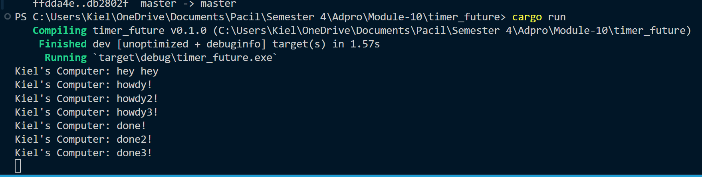
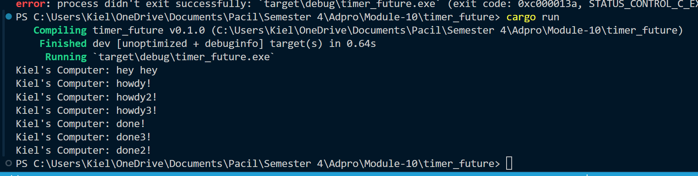

# Understanding how it works.

The main function creates an executor and a spawner. The spawner is used to spawn a new task that prints "Kiel's Computer: howdy!", waits for 2 seconds, and then prints "Kiel's Computer: done!". After the task is spawned, "Kiel's Computer: hey hey" is printed. The spawner is then dropped to indicate that no more tasks will be spawned. The executor is run, which starts executing the tasks in its queue. The executor waits for tasks from its ready_queue, and when it receives a task, it tries to poll the task's future to completion. If the future is not ready, it is put back into the task to be run again in the future. Once the future is ready, the task is completed and the "Kiel's Computer: done!" message is printed. The executor continues to wait for more tasks, but since the spawner has been dropped and no more tasks will be spawned, the executor eventually exits its loop and the program ends. The order of the printed messages is "Kiel's Computer: hey hey", "Kiel's Computer: howdy!", and finally "Kiel's Computer: done!".

# Multiple Spawn and removing drop

## Drop removed

When the program starts, it spawns three asynchronous tasks. Each task is set to print a "howdy" message, wait for 2 seconds, and then print a "done" message. the executor starts running the tasks. Since all three tasks were spawned almost simultaneously, their "howdy" messages print in the order they were spawned: "howdy!", "howdy2!", "howdy3!". Each task then waits for 2 seconds. After the delay, each task prints its "done" message. Again, these messages print in the order the tasks were originally spawned, resulting in "done!", "done2!", "done3!". Because we remove the drop, the executor does not exit its loop and continues to wait for more tasks. However, since no more tasks are spawned, the program does not end.

## With Drop

When the program starts, it spawns three asynchronous tasks. Each task is set to print a "howdy" message, wait for 2 seconds, and then print a "done" message. the executor starts running the tasks. Since all three tasks were spawned almost simultaneously, their "howdy" messages print in the order they were spawned: "howdy!", "howdy2!", "howdy3!". Each task then waits for 2 seconds. After the delay, each task prints its "done" message. Again, these messages print in the order the tasks were originally spawned, resulting in "done!", "done2!", "done3!". Here, because we use drop the executor can exit its loop and the program ends.